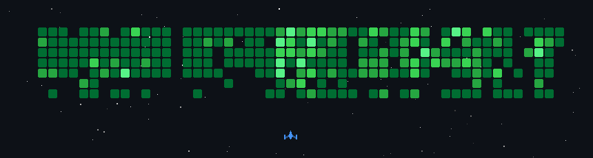

Hi, I'm Shamlo, aka Zoth 
========================

**Full-stack engineer with a QA lead's instincts.** I build products end to end: architecture, backend, UI, deployment, and the tests that keep them honest.

--------------------------

I've been building full-stack for years, including through a Senior QA Lead role, and I still build like a tester: strict types at the boundaries, failure modes designed in rather than discovered in production. These days I build vertical SaaS products for businesses in Kurdistan, mostly on Next.js, NestJS, and PostgreSQL, from my terminal in Neovim.

### 🧱 What I'm building

Each one links to a full case study: the architecture, the decisions, and the ones I got wrong.

- **[Dentra](https://shamlo.dev/projects/healthcare-management-platform)** — Clinic platform, in production. One fully isolated deployment per customer: separate container, separate database, separate object storage, because a tenancy bug in a system holding patient records is a breach rather than a bug. 27 backend modules, 70 test suites, five gates that refuse to boot on an unsafe config.
- **[Atlas](https://shamlo.dev/projects/property-management-platform)** — Real-estate operations platform, and the oldest codebase in the family. Its commercial model lives inside the transactions: plan limits and capability tiers enforced under row locks in the same transaction as the write, not checked on a billing page. Ships in Kurdish, Arabic and English, two of them right to left.
- **[ZothKit](https://shamlo.dev/projects/zothkit)** — The shared foundation under those products: auth, permissions, translations, audit, storage, settings. Extracted too early, which is its own lesson, and now extracted only once real duplication exists and the copies it replaced are deleted.
- **[Jinara](https://shamlo.dev/projects/agency-operations-platform)** — Internal agency operations: clients, contracts, payments, responsibilities.
- **[Azoth](https://shamlo.dev/engineering)** — My engineering platform: what I've learned across software engineering, written in public. Architecture, testing, tooling, and the reasoning behind the decisions.
- **[zoth-skills](https://github.com/shammlo/zoth-skills)** — Open-source Claude Code skills for developers, including Dev Council, a multi-advisor architecture review.
- **[Spectarum](https://shamlo.dev/projects/spectarum-playwright-automation-framework)** — Playwright automation framework that treats quality engineering as infrastructure. A module declares its schema and endpoints; the framework generates the CRUD suite, resolves IDs at runtime, and cleans up what it created.

> The products are private, so the case studies are the code review: what was built, what broke, and what I would do differently.

### 🧭 How I work

- **Make the unsafe state unrepresentable, not forbidden.** A convention you have to remember gets forgotten. A system that refuses to boot on a single-bucket storage config, or a permission check that fails closed on an empty requirement list, does not.
- **Enforce at the layer that cannot be bypassed.** Entitlement checks run inside the transaction under a row lock, not in a button's disabled state. Public projections are built up from what is safe to show, never down from the internal record, because subtraction fails open the day someone adds a column.
- **Validate everything before writing anything.** Bulk imports report every problem across the whole file before a single row lands, because the person fixing it wants the list, not the first error.
- **Write down what was rejected and why.** A deferral without stated reopening criteria is indistinguishable from an oversight six months later.

### 📫 Find me

* 🌍  Based in Erbil, Kurdistan
* 🖥️  <a href="https://shamlo.dev">shamlo.dev</a> — projects, docs, tools, and writing
* 📄  Resume: <a href="https://shamlo.dev/resume" target="_blank">PDF</a>
* ✉️  [zothstic@gmail.com](mailto:zothstic@gmail.com)
* 💼  [LinkedIn](https://www.linkedin.com/in/shamlo-ameer-126289142/) · [X](https://www.twitter.com/Shamlo_)
* 🦀  Currently learning Rust
* 🤝  Open to collaborating on TypeScript, Next.js, and NestJS projects
* 🧘  Off the keyboard: reading, meditation, philosophy, and worldbuilding

---

### 🛠️ Skills

#### Programming Languages

  
  
  
  
  
  
  
  
  

#### Frontend: Frameworks, Libraries & Services

  
  
  
  
  
  
  
  
  
  
  

#### Backend: Frameworks, Databases, Libraries & Services

  
  
  
  
  
  
  
  
  
  
  
  

#### General Tooling & DevOps

  
  
  
  
  
  
  
  
  
  

#### Testing & Quality Assurance

  
  
  
  
  
  
  

---

### 📊 GitHub Stats

